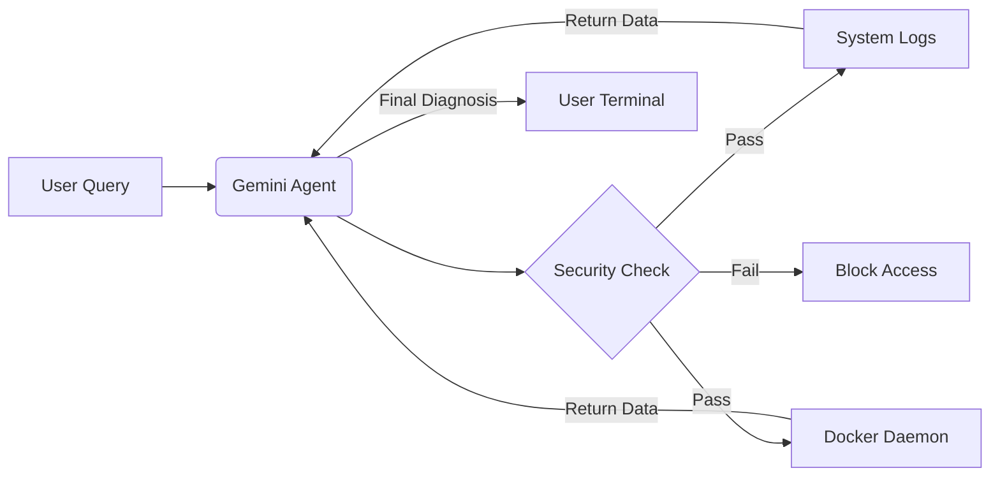

# 🛡️ Auto-SRE: Autonomous Linux System Diagnostics

> An AI-powered Site Reliability Engineer (SRE) agent that securely interacts with the Linux kernel to diagnose logs, monitor resources, and manage container lifecycles in real-time.

## 🚀 Overview

Auto-SRE is not a standard chatbot. It is an **Agentic System** capable of executing read-only system tools to investigate the health of a Linux machine.

Built with the **Google Gemini 2.5 Flash** model, it utilizes **Function Calling (Tool Use)** to bridge the gap between natural language and system observables (Logs, Docker, Disk Usage).

### Key Features
* **🔍 Log Analysis:** Autonomously reads and parses `/var/log/syslog`, `auth.log`, and `kern.log` to identify errors.
* **🐳 Docker Observability:** Interfaces with the local Docker daemon via Python `subprocess` to list active containers and check their health status.
* **🛡️ Built-in Security:** Implements **Path Traversal Protection** to ensure the agent cannot read sensitive files (like `/etc/shadow`) outside of allowed directories.
* **🧠 Context-Aware:** Smartly manages token limits by reading only the relevant "tail" of log files to reduce latency.
* **🖥️ Rich UI:** Features a hacker-style terminal interface with spinners and formatted Markdown output using the `rich` library.

---

## 🏗️ Architecture

The agent follows a 3-layer architecture:
1.  **The Brain (Gemini 2.5):** Reasons about the user's intent and decides which tool to call.
2.  **The Hands (Python Tools):** Executes system calls (`os`, `subprocess`) to fetch actual data.
3.  **The Guardrails:** Validates all file paths before execution to prevent security vulnerabilities.

---

## 🛠️ Installation

**Prerequisites**
* Linux (Ubuntu/Mint/Debian recommended)
* Docker (for container features)
* Python 3.10+
* uv (Recommended) or pip

**Step 1: Clone & Install**

    Bash
    git clone [https://github.com/Sri-Ram-Bala/DevOps_agent.git](https://github.com/Sri-Ram-Bala/DevOps_agent.git) 
    cd auto-sre-agent

    # Using uv (Faster)
    uv venv
    uv pip install -r requirements.txt

    # OR using standard pip
    python3 -m venv .venv
    source .venv/bin/activate
    pip install -r requirements.txt
    

**Step 2: Configure Environment**

Create a .env file in the root directory and add your Google Gemini API key:

        GEMINI_API_KEY= YOUR_GEMINI_API_KEY
        

---

## 💻 Usage

To read `system logs` (like `/var/log/syslog`) and `Docker`, the agent requires read permissions. You have two options:

**Option A: Run as SRE (Root - Recommended for Full Access)**

Use `sudo` while preserving your Python environmentThis guarantees access to `/var/log` and the Docker socket.

        Bash
        # If using uv
        sudo .venv/bin/python sre_agent.py

        # If using standard pip
        sudo -E python3 sre_agent.py
        

Option B: Run as User (Restricted)
If you add your user to the `docker` group (`sudo usermod -aG docker $USER`), you can run the agent without sudo, but it will not be able to read system logs due to Linux security policies.
        
        Bash
        # If using uv
        uv run sre_agent.py

        # If using standard pip
        python3 sre_agent.py

---

## 🛡️ Security Implementation
Security is a core component of this project. The agent does not have unrestricted file access.

The `is_safe_path` function: Before opening any file, the agent resolves the absolute path and verifies it matches the whitelist.

    Python
    # Prevents attacks like: "Read ../../etc/passwd"
    if not absolute_path.startswith("/var/log"):
        raise PermissionError("Access Denied")
    
---

## 🧪 Example Scenario
User: "Why is my system acting weird? Check the logs."

Agent (Internal Thought): User asked for a check. I will call read_system_log('syslog').

Agent (Output):

* I checked /var/log/syslog and found the following error: [ERROR] usb 1-1: device descriptor read/64, error -71

* Diagnosis: It looks like a USB device is failing to initialize. Try unplugging your recent USB devices.

User: "Check if I have any docker containers running."

✅ Success: The agent replies: "I checked and found no Docker containers running" OR "I found these containers: [list of names]".

❌ Error 1 ("Docker not installed"): You skipped Step 1.

❌ Error 2 ("Permission denied"): You forgot to run the python script with sudo.

---

## 📜 License

*MIT License*

